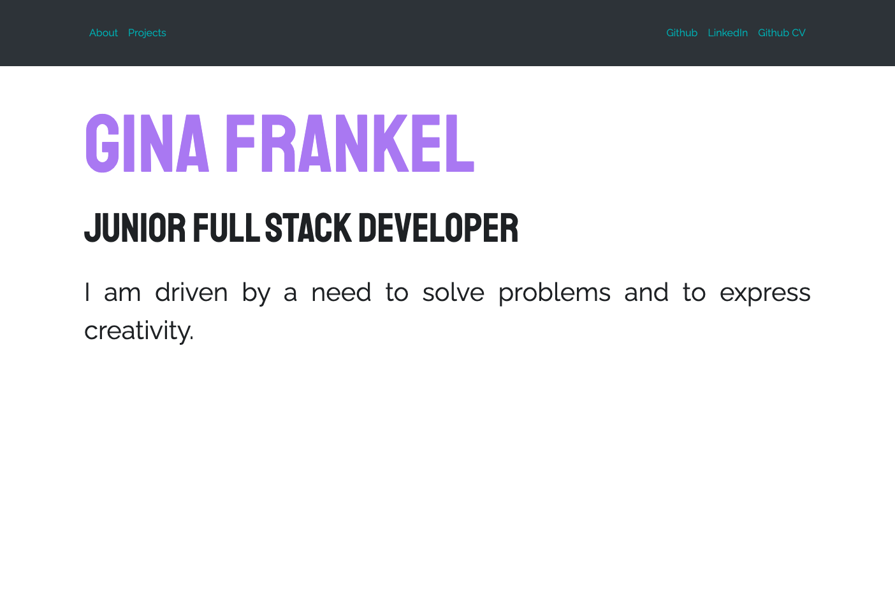
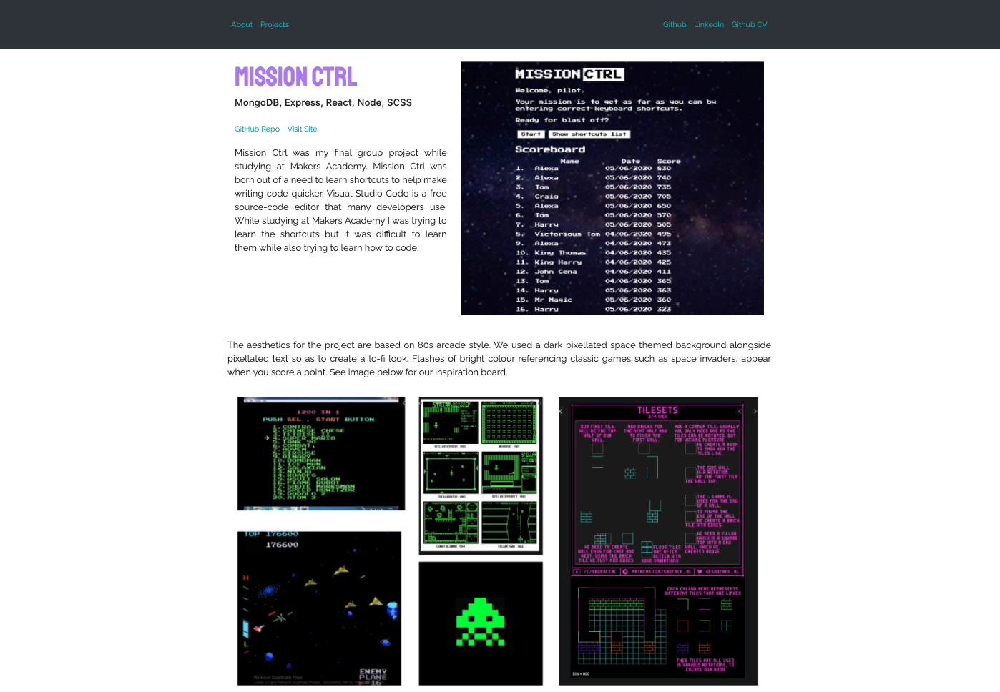
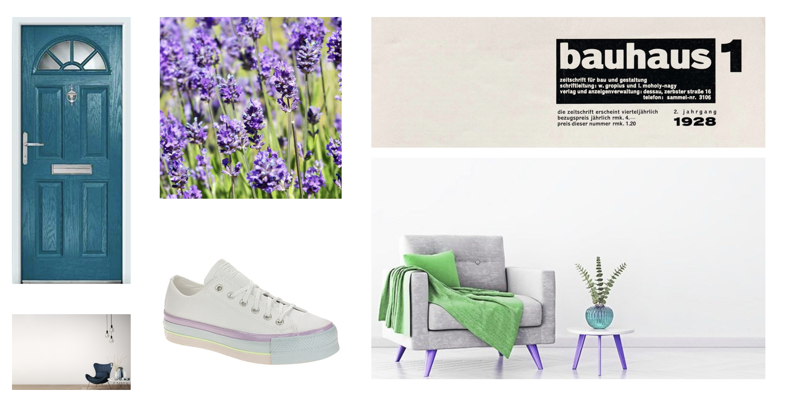
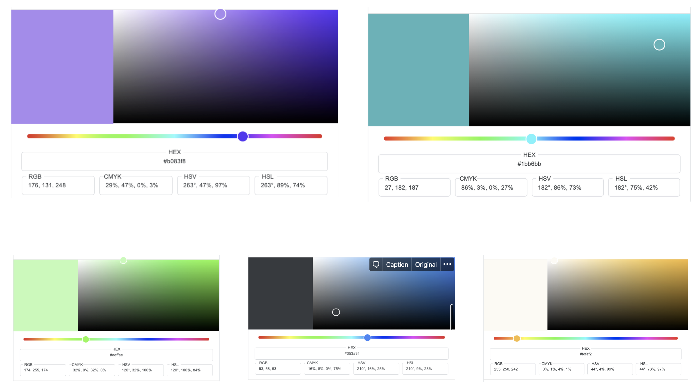

# Personal Portfolio <!-- omit in toc -->

This project was bootstrapped with [Create React App](https://github.com/facebook/create-react-app) and is deployed to ginafrankel.com via Netlify.

## Screen Previews

Front Page

Project Page

About Project Page

## Table of Contents <!-- omit in toc -->

- [Tech Used](#tech-used)
- [Development journal](#development-journal)
  - [User Stories](#user-stories)
    - [1.General information](#1general-information)
    - [2.Projects](#2projects)
  - [Style](#style)
      - [Inpiration:](#inpiration)
      - [Colours:](#colours)
  - [Project management](#project-management)

# Tech Used

| Tech                                                                                      | Description                                                                                                                                            |
| ----------------------------------------------------------------------------------------- | ------------------------------------------------------------------------------------------------------------------------------------------------------ |
| [Create React App](https://reactjs.org/docs/create-a-new-react-app.html#create-react-app) | Sets up your development environment with the latest JavaScript features and optimizes app for production. Selected as recommended for learning React. |
| [Jest]                                                                                    | Unit testing framework.                                                                                                                                |
| [Enzyme]                                                                                  | Unit testing library for React.                                                                                                                        |
| [Netlify]                                                                                 | Host, allows for CI/CD workflow, also provides free SSL certificate.                                                                                   |

# Development journal

## User Stories

### 1.General information

- [x] 1.1 **Short Summary**

  > As a potential employer,
  > I would like there always to be short summary of person, which includes their values and what is their occupation
  > So I know exactly what they are looking for and what type of person they are

- [x] 1.2 **Github Link**

  > As a a potential employer,
  > I would to always be able to link to their github profile,
  > so that I can easily see their coding skills and their github CV

- [x] 1.3 **LinkedIn Link**

  > As a a potential employer,
  > I would like to always have access to a LinkedIn link,
  > so that I can easily contact this person

### 2.Projects

- [x] 2.1 **Names of projects**

  > As a potential employer
  > I would like to be able to see the name of all the projects
  > So I know what projects have been created

- [x] 2.2 **Technology list**

  > As a potential employer,
  > So that I know what technologies the person has experience with,
  > I would like to see a list of the technologies used for each project

- [x] 2.3 **Summary**

  > As a potential employer,
  > So that I can know more information about what the project does and why it was made,
  > I would like to see a summary of each project

- [x] 2.4 **Link to github Repo**

  > As a potential employer,
  > So that I can inspect the project's source code,
  > I would like a link to it's GitHub repo.

- [x] 2.5 **Screenshot**

  > As a potential employer,,
  > So I can quickly know what the project looks like ,
  > I would like to see a screenshot.

- [x] 2.6 **Deployment link**
  > As a potential employer,
  > So that I can see the project in action,
  > I would like a link to where it is deployed.

## Style

- Simple
- Interactive
- Reflects my personality

#### Inpiration:

#### Colours:

> #### Background colour:
>
> **Pure white**
> Selected as creates a fresh simple aesthetic
> Hex #ffffff

---

## Project management

**MVP**

- link to github

**Sprint 2**

- Always available section
- Project section until 2.4
- **Sprint 3**

- Project section - 2.5 + 2.6
